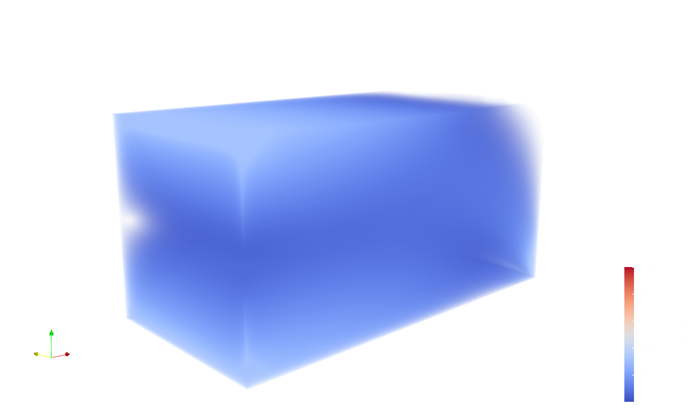
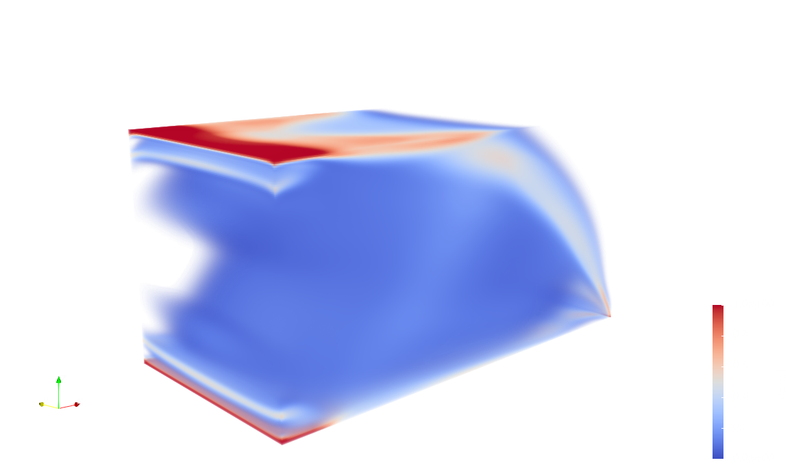
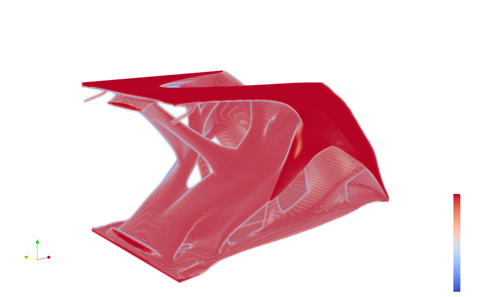
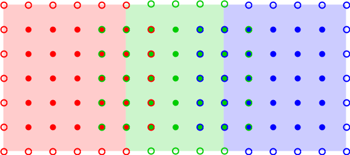

# TopOpt-in-OpenMP-Multi-GPU
Topology optimization for linear elastic minimum compliance with volume constraints on cartesian grids in 3D. Implemented using OpenMP target offloading using multiple GPU acceleration.
<br>
The code in this repository is a direct continuation of the OpenMP code from [Simple and efficient GPU accelerated topology optimisation: Codes and applications](https://www.sciencedirect.com/science/article/pii/S0045782523001676).

## Cantilever Beam Test Problem
The code solves the cantilever beam test problem described in [Parallel framework for topology optimization using the method of moving asymptotes](https://link.springer.com/article/10.1007/s00158-012-0869-2).

One Design Iteration       | Five Design Iterations    | 20 Design Iterations
:-------------------------:|:-------------------------:|:-------------------------:
 |  | 

## Dependencies
The code has been implemented and tested with the following version of `SuiteSparse`, `OpenBLAS`,`NVC`, and `GCC` in mind.

| **Package**           | **Version** | **Installation**                                                                                    |
| :---                  | :---        | :---                                                                                                |
| `SuiteSparse/CHOLMOD` | 5.1.2       | [See Github release notes](https://github.com/DrTimothyAldenDavis/SuiteSparse/releases/tag/v5.1.2)  |
| `OpenBLAS`            | 0.2.20      | [See Github release notes](https://github.com/xianyi/OpenBLAS/releases/tag/v0.2.20)                 |
| `nvhpc`               | 21.9        | [NVIDIA HPC SDK](https://developer.nvidia.com/nvidia-hpc-sdk-releases)                              |
| `CUDA`                | 11.1        | [CUDA Toolkit 11.1.0](https://developer.nvidia.com/cuda-11.1.0-download-archive?target_os=Linux)    |
| `GCC`                 | 13.0        | [See the GCC offloading page](https://gcc.gnu.org/wiki/Offloading)                                  |
| `clang`		| 16.0	      | [See the LLCM offloading page](https://openmp.llvm.org/SupportAndFAQ.html)			    |

### Installing an OpenMP Offloading Enabled Compiler
It is straight forward to install the NVIDIA `nvc` compiler that can be downloaded from the NVIDIA HPC SDK.<br>
Installing an offloading enabled version of `clang` or `gcc` is slightly more complicated. Scripts for installing `gcc` 13 and `clang` 16 for NVPTX, AMD-GCN, and AMD-HSA backends can be found in `./compilers`.

## Compilation
To set `PATH` and `LD_LIBRARY_PATH` you may consider exporting the variables in `paths/gbar/` or `paths/lumi`. For instance, to compile with `NVC` on `gbar.dtu.dk`, load
```{bash}
source paths/gbar/nvc.sh
```
The `config` directory contains makefiles for `NVC` and `GCC` and `config/gpu` contains makefiles for specific offloading targets. To compile the code for Nvidia Tesla V100 with `GCC` you may type
```{bash}
make COMPILER=gcc GPU=V100
```
A number of definitions are necessary to achieve good performance on a specific architecture. One can adjust the following settings.

| **Variable**            | **Options**       | **Description**                                               |
| :---                    | :---              | :---                                                          |
| `USE_CHOLMOD`           | 1 (on) or 0 (off) | Use a direct solver on the coarsest multigrid level           |
| `SIMD`                  | 1 (on) or 0 (off) | Add explicit `#pragma omp simd` directives in target regions  |
| `STENCIL_SIZE_Y`        | 2^k,k>1           | Select a block size for simd operations of at least two       |

For instance, compile with 
```{bash}
make COMPILER=nvc GPU=A100 USE_CHOLMOD=1 SIMD=0 STENCIL_SIZE_Y=4
```
to target a Nvidia Tesla A100 GPU with `NVC` that uses a direct solver on the coarsest level, does not use SIMD pragmas and uses blocks of size four.

## Example Execution
Remember that the domain is partitioned along the x-axis. Hence, the length in x divided by the number of GPUs divided by the number of levels should be at least 1. For example, try
```{bash}
OMP_NUM_THREADS=8 CUDA_VISIBLE_DEVICES=0,1 ./top3d 512 256 256 1 0 3 5
```
to run three iterations of an experiment without saving the result in verbode mode while using 5 levels in the MG preconditioner. If you type
```{bash}
./top3d
```
without any input arguments you will be prompted how to use the executable.

## Domain Partitioning
The following figure illustrates how voxels and lattices are partitioned amongst the GPUs. 
<p align="center">
  
</p>
In the example, the XY-plane is 12 times 4 voxels yielding that each GPU owns $4\times 4$ voxels. The hollow circles indicate halo lattices and the dense points indicate interior lattices.
